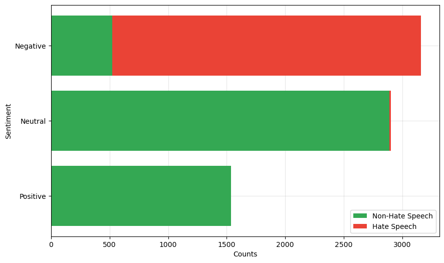

# HateThaiSent Dataset and ThaiCaps multi-tasking framework

**_Krishanu Maity, A.S. Poornash, Shaubhik Bhattacharya, Salisa Phosit, Sawarod Kongsamlit, Sriparna Saha, and Kitsuchart Pasupa_**

---

This repository contains annotated data of Thai hate speech available for hate speech detection and sentiment analysis and also the proposed multi-task deep learning framework ThaiCaps along with its SOTA counterparts for comparison, which appeared in the paper
"[HateThaiSent: Sentiment-Aided Hate Speech Detection in Thai Language]()"

## Details
- The dataset contains 7597 messages.
- The annotations are contained in the format of a CSV file.
- Each message was annotated by the hateful `Hatespeech`, `Nonhatespeech` and the sentiment `Positive`, `Neutral`, `Negative` of the message.
- The Baselines folder contains the compared SOTA approaches and the ThaiCaps folder contains the proposed framework.
- Each framework has a run.py file which can be executed with -
    ```bash
    CUDA_VISIBLE_DEVICES=0 python run.py


## Licensing

This dataset is licensed under the [MIT License](https://opensource.org/licenses/MIT).


## Citation
- Krishanu Maity, A.S. Poornash, Shaubhik Bhattacharya, Salisa Phosit, Sawarod Kongsamlit, Sriparna Saha, and Kitsuchart Pasupa (2024). HateThaiSent: Sentiment-Aided Hate Speech Detection in Thai Language.

```bibtex
@article{HateThaiSent,
    author = {Krishanu Maity, A.S. Poornash, Shaubhik Bhattacharya, Salisa Phosit, Sawarod Kongsamlit, Sriparna Saha, and Kitsuchart Pasupa},
    title = {{HateThaiSent: Sentiment-Aided Hate Speech Detection in Thai Language}},
    journal = {IEEE Transactions on Computational Social Systems},
    year = {2024},
}
```
